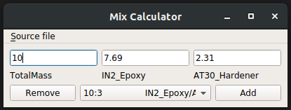
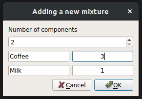
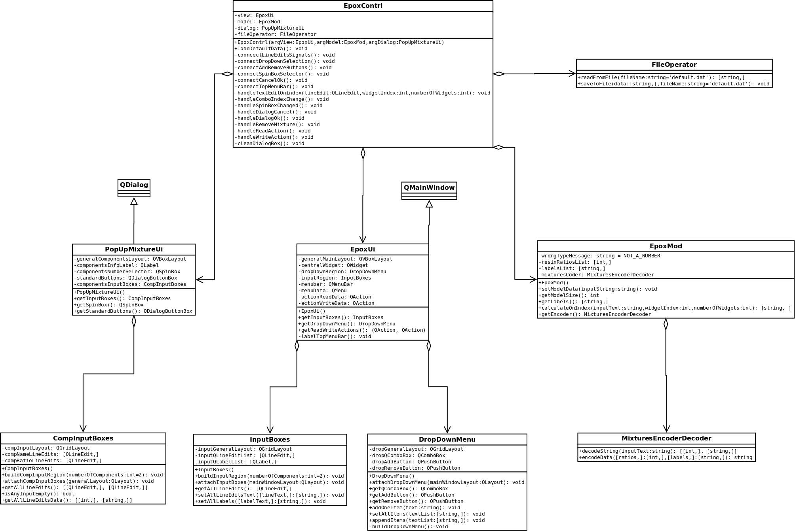

# Description

This application allows for calculation of mixture's components, based on given proportions.

## How to run app

1. Clone this repository.
2. Install Python 3 together with PyQt5 package.
3. Run 'main.py'

## How it works

Pick your mixture from drop-down menu and type desired value for one of its components.
The rest of parameters will be calculated based on correct ratio.

## User stories

This version supports the following features for its users:
- calculating components and total mass of mix
- adding custom mixtures
- removing mixtures
- saving mixtures dataset to selected file
- reading mixtures from a file

## How does the app look like

Calculating correct epoxy-hardener mix for composites enthusiast: 

After hard work with composites we can add a new mixture: 

Finally, archiving mixtures for future use: 

## Under the hood

Code structure was inspired by model-view-controller design pattern. In my implementation model and view are not dependent on each other.
All actions triggerd by UI are handled by controller which is resposible for managing flow between model and view.
Attached below UML class diagram can give more insight into code structure.

